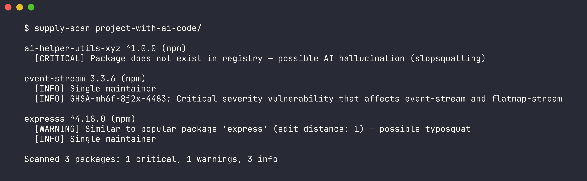

# supply-scan

Scan your project's dependencies for malicious, typosquatted, and AI-hallucinated packages. Catches the packages that `npm audit` and `pip-audit` miss.

## Demo



## The Problem

LLMs hallucinate fake package names about 20% of the time. Attackers register those names with malware — a technique called "slopsquatting." You paste AI-generated code, run `npm install`, and now you're running a package that shouldn't exist. Traditional security scanners check for known CVEs but miss this entirely.

Beyond hallucinations: typosquatted packages (`expresss` instead of `express`), packages with suspicious install scripts, and packages from compromised single-maintainer accounts continue to slip through standard audits.

## How It Works

Point it at any project directory:

```bash
supply-scan .
```

It auto-detects the ecosystem (npm or PyPI), parses your dependency files, then runs four checks concurrently:

1. **Existence check** — Does this package actually exist in the registry? If not, it was likely hallucinated by an AI code generator. Flagged as CRITICAL.
2. **Typosquat detection** — Levenshtein distance against the top 200 popular packages per ecosystem. Catches `expresss`, `reqeusts`, `lodasah`. Flagged as WARNING.
3. **Vulnerability scan** — Queries OSV.dev (Google's vulnerability database) for known CVEs. Severity-mapped to CRITICAL/WARNING/INFO.
4. **Signal analysis** — Flags packages published in the last 30 days, packages with install scripts (`preinstall`/`postinstall`), and single-maintainer packages.

Typosquat detection uses a three-way filter to minimize false positives: edit distance <= 2 AND the similar package is in the top-200 popularity list AND the scanned package is NOT popular itself.

## Install

```bash
cargo install supply-scan
```

Or build from source:

```bash
git clone https://github.com/jtsilverman/supply-scan
cd supply-scan
cargo build --release
```

## Usage

```bash
# Scan current directory
supply-scan

# Scan a specific project
supply-scan /path/to/project

# JSON output for CI pipelines
supply-scan --json .

# Pre-commit hook (exits 1 on CRITICAL findings)
supply-scan --pre-commit .

# Skip network checks (local analysis only)
supply-scan --no-network .

# Show all packages including clean ones
supply-scan --verbose .

# Force ecosystem detection
supply-scan --ecosystem npm .
```

## What It Checks

| Check | Risk Level | What It Catches |
|-------|-----------|----------------|
| Hallucination | CRITICAL | Package doesn't exist in registry (AI-generated fake name) |
| Typosquat | WARNING | Name within edit distance 2 of a popular package |
| Known vuln (high) | CRITICAL | CVE with high/critical severity via OSV.dev |
| Known vuln (medium) | WARNING | CVE with medium severity |
| Known vuln (low) | INFO | CVE with low severity |
| Install scripts | WARNING | `preinstall`, `postinstall`, or `install` scripts in package.json |
| New package | WARNING | Published within the last 30 days |
| Single maintainer | INFO | Only one maintainer on the package |

## Supported Ecosystems

- **npm** — Parses `package.json` (dependencies + devDependencies)
- **PyPI** — Parses `requirements.txt` and `pyproject.toml`

## Tech Stack

- **Rust** — Fast, single binary, no runtime dependencies
- **reqwest** — Async HTTP client for registry APIs
- **strsim** — Levenshtein distance for typosquat detection
- **OSV.dev** — Google's open vulnerability database (free, no auth)
- **npm registry** + **PyPI JSON API** — Package metadata (free, no auth)

## The Hard Part

Typosquat detection with low false positives. Levenshtein distance alone flags too many legitimate packages (e.g., `cors` vs `core` are distance 1). The solution: a three-way check that only flags when (a) edit distance is 1-2, (b) the similar package is genuinely popular (top 200), and (c) the scanned package itself isn't popular. This catches real typosquats like `expresss` while ignoring legitimate similar-named packages.

## License

MIT
